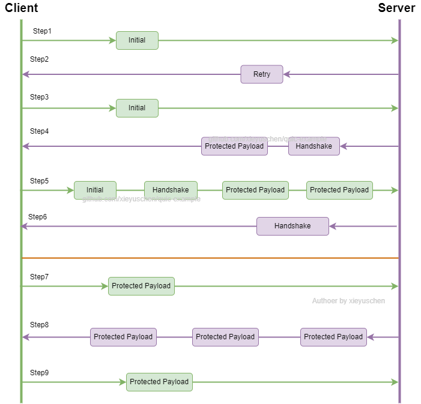
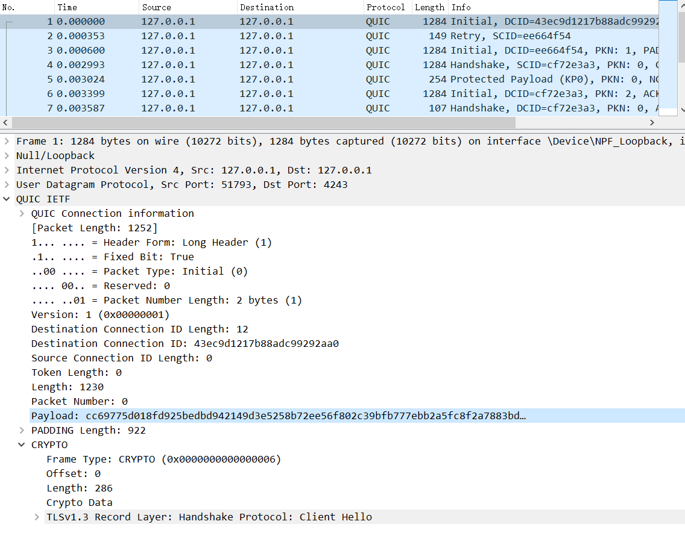
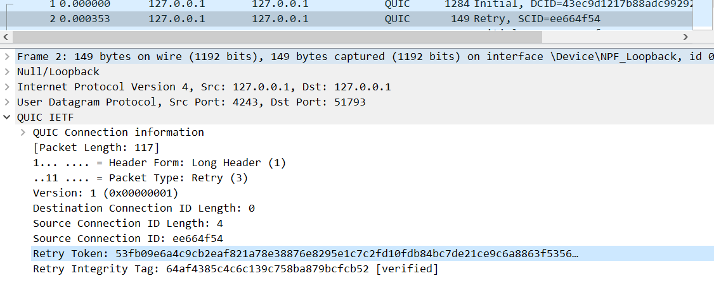
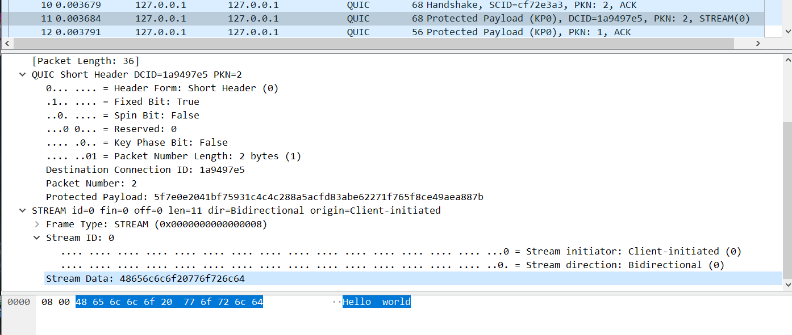

# 3.packets-during-echo

This section aims to learn about the packets during the echo example.
If we want to use wireshark to capture and analysis packets,
the key pair and certificate should be fixed as we need it to decrypt the
packets. As a result, the cert files are stored under `/cert` folder.

## How to decrypt the packets

As the quic standard document has been released in 2021.05, wireshark
could analysis it automatically.

**Note that you need to use a version that supports RFC draft-27**.

When you capture the quic packets, you might see this error information
in wireshark. It's caused by you don't have the master secret of the TLS.

```
Expert Info (Warning/Decryption):
Failed to create decryption context: Secrets are not available
```

You could configure the TLS config and get the key, then load this key
to wireshark so you can see the decrypted packets content.  
[Issue 5](https://github.com/xieyuschen/quic-example/issues/5) has tracked
it.

## TLS Handshake

[TLS reference in cloudflare blog](https://www.cloudflare.com/learning/ssl/what-happens-in-a-tls-handshake/).

TLS is an encryption protocol designed to secure Internet communications. A TLS handshake is the process that kicks
off a communication session that uses TLS encryption. During a TLS handshake, the two communicating sides exchange
messages to acknowledge each other, verify each other, establish the encryption algorithms they will use, and agree
on session keys.

TLS(transport layer security) is the successor of ssl(secure socket layer). The handshake will take place those actions
as version negotiating, ensure cipher, exchange the certificated data and generate session:

- Specify which version of TLS (TLS 1.0, 1.2, 1.3, etc.) they will use.
- Decide on which cipher suites (see below) they will use.
- Authenticate the identity of the server via the server’s public key and the SSL certificate authority’s digital
  signature.
- Generate session keys in order to use symmetric encryption after the handshake is complete.

Note that QUIC **uses TLSv1.3 which based on the ephemeral Diffie-Hellman algorithm**.

### Steps in TLS handshake

1. The `client hello` message.  
   `client hello` sends:
   - TLS version the client supports.
   - cipher suites supported.
   - a string of random bytes known as the `client random`.

2. The `server hello` message  
   `server hello` replies the `client hello` with:
   - server's SSL certificate.
   - the server's chosen cipher suite.
   - server random.

3. Server's digital signature  
The server uses its private key to encrypt the client random, the server random, and its DH parameter*. 
This encrypted data functions as the server's digital signature, establishing that the server has the private key that 
matches with the public key from the SSL certificate.


4. Digital signature confirmed  
The client decrypts the server's digital signature with the public key, verifying that the server controls the 
private key and is who it says it is. Client DH parameter: The client sends its DH parameter to the server.

5. Client and server calculate the premaster secret  
The client and server use the DH parameters they exchanged to calculate a matching premaster secret separately.

6. Session keys created  
   This step generates the session.Both client and server generate session keys from the client random, the server random,
   and the premaster secret. **They should arrive at the same results**.

7. Client is ready  
   The client sends a "finished" message that is encrypted with a session key.

8. Server is ready  
   The server sends a "finished" message encrypted with a session key.

9. Secure symmetric encryption achieved  
   The handshake is completed, and communication continues using the session keys.


*DH parameter: DH stands for Diffie-Hellman. The Diffie-Hellman algorithm uses exponential calculations to arrive at 
the same premaster secret. The server and client each provide a parameter for the calculation, and when combined they 
result in a different calculation on each side, with results that are equal.

## Quic Packet format

Quic packet format is defined by RFC 9000 and you can view it to find
more. The topic here aims to introduce briefly for the following packets
analysis.

### Type of quic headers: Long and short header

Unlike TCP where the packet header format is fixed, QUIC
has two types of packet headers.

- Long header:  
  QUIC packets for connection establishment need to contain several pieces of information,
  it uses the long header format.
- Short header:
  The short header format that is used after the handshake is completed.
  Once a connection is established, only certain header fields are necessary, the subsequent
  packets use the short header format for efficiency.

### Packet format

- Initial packet:
- Retry packet:
- Handshake packet:
- Protected payload packet:

## Quic connection handshake procedures

In the echo example here, the workflow between client and server looks like as the following,
the origin line in the workflow picture separates connection establishing and stream establishing.



### Step1: Initial packet from client

[RFC 17.2.2](https://www.rfc-editor.org/rfc/rfc9000.html#section-17.2.2) shows the Initial packet format. As we use 
wireshark to analyze the packet and it has already unmarshalled the packets, here won't explain format too much but 
only note some points.

- Quic is based on the UDP and IP layer, so it contains IP packet and UDP packet. IP header contains 20 bytes(or five 
  32-bit increments with max 24 bytes). The UDP header is 8 bytes length. Note that in the hex displaying mode, every 
  hex character stands for 4 bits(2^4).

In step1, the initial packet is shown as the following picture:
  

- Random Destination Connection ID and empty Source Connection ID:  
  When the client wants to establish a new connection, the `Destination Connection ID` is valid but the 
  `Source Connection ID` is invalid as null. 
  [7.2.3-Negotiating Connection IDs](https://www.rfc-editor.org/rfc/rfc9000.html#section-7.2-3) says:

  > When an Initial packet is sent by a client that has not previously received an Initial or Retry packet from the
  > server, the client populates the Destination Connection ID field with an unpredictable value. This Destination
  > Connection ID MUST be at least 8 bytes in length. Until a packet is received from the server, the client MUST use
  > the same Destination Connection ID value on all packets in this connection.
  
  So in step1, the Destination Connection Id is generated by client side.

- empty token:  
Token is used to validate the address to avoid attacking and it's generated by server. 
So the step1 takes an empty token.

- CRYPTO: client hello
  The first packet sent by a client always includes a CRYPTO frame that contains the start or all of the first
  cryptographic handshake message. The first CRYPTO frame sent always begins at an offset of 0.
  The CRYPTO frame encapsulates a TLSv1.3 `ClientHello` directly.

### Step2: Retry packet from server

The retry packet aims to:

- start to negotiate the connection id.
- pass the token to client.



[RFC9000-7-Negotiating Connection IDs](https://www.rfc-editor.org/rfc/rfc9000.html#name-negotiating-connection-ids) says:

> The Destination Connection ID field from the first Initial packet sent by a client is used to determine packet
> protection keys for Initial packets. These keys change after receiving a Retry packet.

**This step aims to verify the connection valid for avoiding traffic amplification attack** and
the token will be sent to client with a `RETRY` packet.

#### Code implement details in quic-go

The code implement details is in
`server.go:395 func (s *baseServer) handleInitialImpl(p *receivedPacket, hdr *wire.Header) error`. We could check that
in which case the server side will send a `RETRY` packet.

```go
	if !s.config.AcceptToken(p.remoteAddr, token) {
		go func() {
			defer p.buffer.Release()
			if token != nil && token.IsRetryToken {
				if err := s.maybeSendInvalidToken(p, hdr); err != nil {
					s.logger.Debugf("Error sending INVALID_TOKEN error: %s", err)
				}
				return
			}
			if err := s.sendRetry(p.remoteAddr, hdr, p.info); err != nil {
				s.logger.Debugf("Error sending Retry: %s", err)
			}
		}()
		return nil
	}
```

As a result, the function call `s.config.AcceptToken(p.remoteAddr, token)` decides to send `RETRY` or not. Add a
breakpoint to see the details. The server side checks the client initial packet by the following code and this is a
great interface usage as it abstract(todo).

```go
var defaultAcceptToken = func(clientAddr net.Addr, token *Token) bool {
	if token == nil {
		return false
	}
	validity := protocol.TokenValidity
	if token.IsRetryToken {
		validity = protocol.RetryTokenValidity
	}
	if time.Now().After(token.SentTime.Add(validity)) {
		return false
	}
	var sourceAddr string
	if udpAddr, ok := clientAddr.(*net.UDPAddr); ok {
		sourceAddr = udpAddr.IP.String()
	} else {
		sourceAddr = clientAddr.String()
	}
	return sourceAddr == token.RemoteAddr
}
```

If it needs send a RETRY packet, the server side construct a token to send back:

```go
func (s *baseServer) sendRetry(remoteAddr net.Addr, hdr *wire.Header, info *packetInfo) error {
  // ignore some lines
  token, err := s.tokenGenerator.NewRetryToken(remoteAddr, hdr.DestConnectionID, srcConnID)
  // ignore some lines
}
```

### Step3: The second Initial packet from client

The Initial packet aims to:

- send initial packet with the following values got from `RETRY`:
  - Token from retry.
  - Destination Connection ID from retry.
  - Client hello in `CRYPTO` frame.
  
### Step4: The Handshake packet from server

The Handshake packet aims to:

- Send an ACK back.
- Send a Source Connection ID.
- Make a server hello to client and send multiple handshake messages (includes Encrypted extensions, Certificate 
and Certificate Verify). This step mixes multiple steps in TLS handshake shown up.

The ack make sure the reliability in quic, say [RFC 13.2.1](https://www.rfc-editor.org/rfc/rfc9000.html#section-13.1-3).

(TODO: learn more about the reliability implement details).

### Step4: Protected payload after the handshake packet of server

The Protected payload packet aims to:

- send `CRYPTO` with multiple handshake message(step3-Server's digital signature) in TLS establish.
- send `NEW_CONNECTION_ID`.

After the handshake sent by server, there is a `protected packet`. This `protected packet` has two IETF quic packets,
one is `CRYPTO` and the other is `NEW_CONNECTION_ID`.

- IETF packet which contains `CRYPTO` frame:  
  It uses a long header and its `CRYPTO` frame stores tls handshake protocol messages
  (includes Certificate Verify and finish).

- IETF packet which contains `NEW_CONNECTION_ID`:  
  This packet use a **short header** and contains 3 `NEW_CONNECTION_ID` parts.
  //todo: short header definition.
  // why here is 3 `NEW_CONNECTION_ID`?

### Step5: Initial packet from client

The Initial packet aims to:

- send an ACK to server.

After the server sends the handshake packet which contains the tls handshake packets and the protected payload which
contains the `NEW_CONNECTION_ID`, the client sends an ack back with an `Initial` packet.

### Step5: Handshake packet from client

The Handshake packet aims to:

- send ack to server.
- send handshake `finish` to server.

In this step, **TLS connection has been established**!  

Handshake packet contains an ack and a `CRYPTO` which contains a tls handshake `finish` data.

### Step5:Two Protected Payload from client
- The first one sends an ACK back.
- The second one sends an `ENTIRE_CONNECTION_ID`.

After they are done, all works in establishing a connection has been ended and the client is waiting to receive an ACK 
from the server.  

Note that both of those two use the **short header**.

### Step6:Handshake packet from server

The server sends back an ACK with a **short header**. 

Note that after receiving this packet, **a connection has been established for both endpoints**.


## Quic stream handshake procedures
Quic stream based on the quic connection. In the workflow picture, establishing the quic stream starts at step7.

### Step7: Payload from client to server
- use short quic header.
- stream information such as id, bidirectional and son on.
- **send data to the server**.  

Quic allows users to send data without establishing a stream.




### Step8: Server replies the payload from the client
In step8, there are three packets:
- First packet: sends ACK.  
- Second packet: HANDSHAKE_DONE, NEW_TOKEN and `New session ticket` in CRYPTO.
- Third packet: An ACK and echo data `Hello world` as echo back. **Note that currently the stream is still 
establishing**.  

### Step9: Client sends an ACK back
After receiving all of three packets, the client sends an ACK back. Eventually, the interactions between client and 
server echo has ended here.