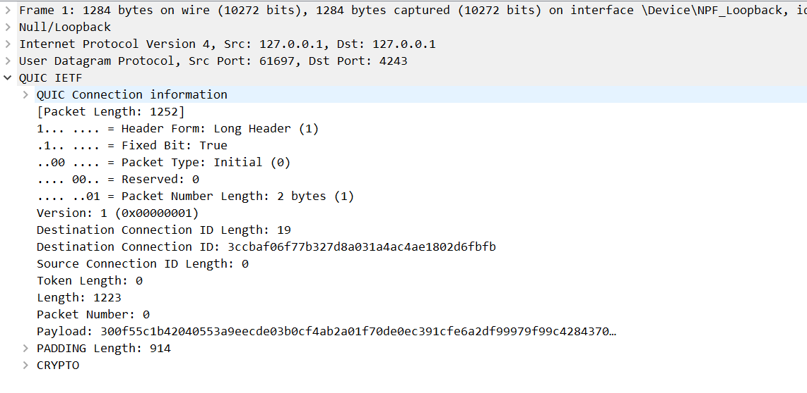

# 3.packets-during-echo
This section aims to learn about the packets during the echo example. First, the tools used here will be discussed and 
then will show the packet details.

## Tools discussion
There are many popular tools to monitor the network such as `wireshark`, `tcpdump`, `netstat` and so on. As quic 
underlies the udp protocol, what we should do is to find a useful tool on UDP.
### Linux networking tools
- ss:  
  ss command is a tool that is used for displaying network socket related information on a Linux system.

- tcpdump:
  Tcpdump is a command line utility that allows you to capture and analyze network traffic going through your system.
  It is often used to help troubleshoot network issues, as well as a security tool.

- nmap:
  Nmap is short for Network Mapper. It is an open-source Linux cmd-line tool that is used to scan IPs 
  & ports in a nw & to detect installed apps. Nmap allows nw admins to find which devices r running 
  on their nw, discover open ports & services, and detect vulnerabilities.

- dig:
  Dig (Domain Information Groper) is a powerful cmd-line tool for querying DNS name servers.
  It allows you to query info abt various DNS records, including host addresses, mail exchanges, 
  & name servers. A most common tool among sysadmins for troubleshooting DNS problems.
  
Linux provides many network tools, but if we want to take an eye on the packets the `tcpdump`. 

However, `tcpdump` could only dump the udp packets and it's hard to encrypt the quic packets as:
- quic encapsulates the udp with its own protocol which means I need to analysis udp to quic.
- quic has explained its packet details with a large scope in RFC9000 so read and analyze the udp packets ourselves 
cause a messy experience.

In concluding, `wireshark` is a better tool than `tcpdump`.

## Network Analyzing tools

If we want to use tcpdump to see the packets, the key pair and certificate should be fixed as we need it to decrypt the 
packets. As a result, I choose the files under `/cert` files:

### Commands to see the details
- See the certificate details:
```shell
quic-example/cert$ openssl x509 -in ca.pem -noout -text
```

- Tcpdump to see the udp packets:
```shell
sudo tcpdump -nnvXSs 0 -i lo port 4242 -xx -tt
```
Ignoring `-X` option can avoid converting hex to text and it helps to decrypt.

## Handshake precedences
### Quic Packet format
Unlike TCP where the packet header format is fixed, QUIC
has two types of packet headers. QUIC packets for connection establishment need to contain several pieces of information, it uses the long header format. Once a connection is established, only certain header fields are necessary, the subsequent packets use the short header format for efficiency [13].
The short header format that is used after the handshake is
completed is demonstrated in Fig. 4. In each packet, one or
more frames can be embedded in it and each frame does not
need to be of the same type as long as it is within the MTU
limit.
Each packet in a QUIC connection is assigned a unique
packet number. This number increases monotonically, indicating the transmission order of packets and is decoupled
from loss recovery 5
. Therefore, it can be used to tell easily and accurately about how many packets may be inside the network, as compared to TCP congestion control which
shares the same flow control window used for reliability.
QUIC receiver ACKs the largest packet number ever received, together with selective ACK (ACKing all received
packets below it, coded in continuous packet number ranges)
as shown in Figure 5. The use of purposely defined ACK
frames can support up to 256 ACK blocks in one ACK frame,
as compared to TCP’s 3 SACK ranges due to TCP option field
size limit. This allows QUIC to ACK received packets repeatedly in multiple ACK frames, leading to higher resiliency
against packet reordering and losses. When a QUIC packet
is ACKed, it indicates all the frames carried in that packet
have been received.

### Initial packet
The packet content is consisted by the following parts:

- IPv4 header and UDP(user datagram protocol) header.  
IP header contains 20 bytes(or five 32-bit increments with max 24 bytes). The UDP header is 8 bytes length.
Note that in the hex displaying mode, every hex character stands for 4 bits(2^4).

- QUIC IETF.  
The RFC says:
> Initial packets use an AEAD function, the keys for which are derived using a value that is visible
on the wire. Initial packets therefore do not have effective confidentiality protection. Initial
protection exists to ensure that the sender of the packet is on the network path. Any entity that
receives an Initial packet from a client can recover the keys that will allow them to both read the
contents of the packet and generate Initial packets that will be successfully authenticated at
either endpoint. The AEAD also protects Initial packets against accidental modification.

The Initial packet format is:
```
Initial Packet {
  Header Form (1) = 1,
  Fixed Bit (1) = 1,
  Long Packet Type (2) = 0,
  Reserved Bits (2),
  Packet Number Length (2),
  Version (32),
  Destination Connection ID Length (8),
  Destination Connection ID (0..160),
  Source Connection ID Length (8),
  Source Connection ID (0..160),
  Token Length (i),
  Token (..),
  Length (i),
  Packet Number (8..32),
  Packet Payload (8..),
}
```
If using `tcpdump` to analyze the packets, remember to remove the IP header and udp header. Here are some details about 
a quic initial packet:

There are some interesting variables in the initial format:
- Destination/Source connection ID:  
When the client wants to establish a new connection, the `Destination Connection ID` is valid but the `Source 
Connection ID` is invalid as null.

- Payload:  
// todo
- PADDING:
// todo

- CRYPTO:
// todo

