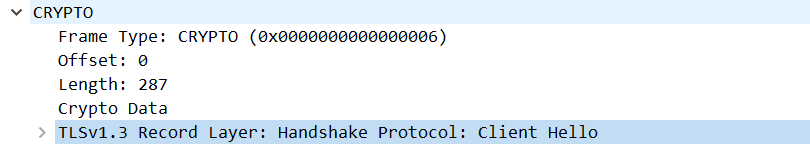
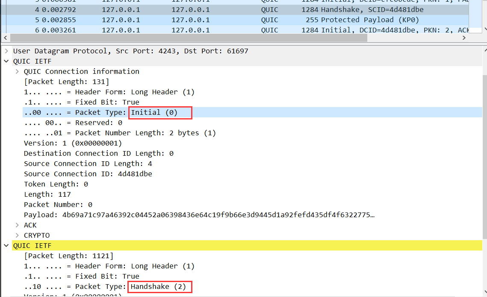

# 3.packets-during-echo

This section aims to learn about the packets during the echo example. First, the tools used here will be discussed and
then will show the packet details.

## Tools discussion

There are many popular tools to monitor the network such as `wireshark`, `tcpdump`, `netstat` and so on. As quic
underlies the udp protocol, what we should do is to find a useful tool on UDP.

### Linux networking tools

- ss:  
  ss command is a tool that is used for displaying network socket related information on a Linux system.

- tcpdump:
  Tcpdump is a command line utility that allows you to capture and analyze network traffic going through your system.
  It is often used to help troubleshoot network issues, as well as a security tool.

- nmap:
  Nmap is short for Network Mapper. It is an open-source Linux cmd-line tool that is used to scan IPs
  & ports in a nw & to detect installed apps. Nmap allows nw admins to find which devices r running
  on their nw, discover open ports & services, and detect vulnerabilities.

- dig:
  Dig (Domain Information Groper) is a powerful cmd-line tool for querying DNS name servers.
  It allows you to query info abt various DNS records, including host addresses, mail exchanges,
  & name servers. A most common tool among sysadmins for troubleshooting DNS problems.

Linux provides many network tools, but if we want to take an eye on the packets the `tcpdump`.

However, `tcpdump` could only dump the udp packets and it's hard to encrypt the quic packets as:

- quic encapsulates the udp with its own protocol which means I need to analysis udp to quic.
- quic has explained its packet details with a large scope in RFC9000 so read and analyze the udp packets ourselves
  cause a messy experience.

In concluding, `wireshark` is a better tool than `tcpdump`.

## Network Analyzing tools

If we want to use tcpdump to see the packets, the key pair and certificate should be fixed as we need it to decrypt the
packets. As a result, I choose the files under `/cert` files:

### Commands to see the details

- See the certificate details:

```shell
quic-example/cert$ openssl x509 -in ca.pem -noout -text
```

- Tcpdump to see the udp packets:

```shell
sudo tcpdump -nnvXSs 0 -i lo port 4242 -xx -tt
```

Ignoring `-X` option can avoid converting hex to text and it helps to decrypt.


## Handshake precedences

The handshake precedences in the echo demo:

```
  o
  |
  |
  v
+--------+
|Initial |
+--------+
```

### Quic Packet format

Unlike TCP where the packet header format is fixed, QUIC
has two types of packet headers. QUIC packets for connection establishment need to contain several pieces of information, it uses the long header format. Once a connection is established, only certain header fields are necessary, the subsequent packets use the short header format for efficiency [13].
The short header format that is used after the handshake is
completed is demonstrated in Fig. 4. In each packet, one or
more frames can be embedded in it and each frame does not
need to be of the same type as long as it is within the MTU
limit.
Each packet in a QUIC connection is assigned a unique
packet number. This number increases monotonically, indicating the transmission order of packets and is decoupled
from loss recovery 5
. Therefore, it can be used to tell easily and accurately about how many packets may be inside the network, as compared to TCP congestion control which
shares the same flow control window used for reliability.
QUIC receiver ACKs the largest packet number ever received, together with selective ACK (ACKing all received
packets below it, coded in continuous packet number ranges)
as shown in Figure 5. The use of purposely defined ACK
frames can support up to 256 ACK blocks in one ACK frame,
as compared to TCP’s 3 SACK ranges due to TCP option field
size limit. This allows QUIC to ACK received packets repeatedly in multiple ACK frames, leading to higher resiliency
against packet reordering and losses. When a QUIC packet
is ACKed, it indicates all the frames carried in that packet
have been received.

### Initial packet

The packet content is consisted by the following parts:

- IPv4 header and UDP(user datagram protocol) header.  
  IP header contains 20 bytes(or five 32-bit increments with max 24 bytes). The UDP header is 8 bytes length.
  Note that in the hex displaying mode, every hex character stands for 4 bits(2^4).

- QUIC IETF.  
  The RFC says:
  > Initial packets use an AEAD function, the keys for which are derived using a value that is visible
  > on the wire. Initial packets therefore do not have effective confidentiality protection. Initial
  > protection exists to ensure that the sender of the packet is on the network path. Any entity that
  > receives an Initial packet from a client can recover the keys that will allow them to both read the
  > contents of the packet and generate Initial packets that will be successfully authenticated at
  > either endpoint. The AEAD also protects Initial packets against accidental modification.

The Initial packet format is:

```
Initial Packet {
  Header Form (1) = 1,
  Fixed Bit (1) = 1,
  Long Packet Type (2) = 0,
  Reserved Bits (2),
  Packet Number Length (2),
  Version (32),
  Destination Connection ID Length (8),
  Destination Connection ID (0..160),
  Source Connection ID Length (8),
  Source Connection ID (0..160),
  Token Length (i),
  Token (..),
  Length (i),
  Packet Number (8..32),
  Packet Payload (8..),
}
```

If using `tcpdump` to analyze the packets, remember to remove the IP header and udp header. Here are some details about
a quic initial packet:

There are some interesting variables in the initial format:

- Destination/Source connection ID:  
  When the client wants to establish a new connection, the `Destination Connection ID` is valid but the `Source Connection ID` is invalid as null. However, in
  [7.2.3-Negotiating Connection IDs](https://www.rfc-editor.org/rfc/rfc9000.html#section-7.2-3):

  > When an Initial packet is sent by a client that has not previously received an Initial or Retry packet from the 
  > server, the client populates the Destination Connection ID field with an unpredictable value. This Destination 
  > Connection ID MUST be at least 8 bytes in length. Until a packet is received from the server, the client MUST use 
  > the same Destination Connection ID value on all packets in this connection.

  As a result, the finial connection ID will be generated from the server/
  
- token:  
  A variable-length integer specifying the length of the Token field, in bytes.
  This value is 0 if no token is present. Initial packets sent by the server MUST set the Token Length field to 0;
  clients that receive an Initial packet with a non-zero Token Length field MUST either discard the packet or
  generate a connection error of type PROTOCOL_VIOLATION.

- CRYPTO:
  The first packet sent by a client always includes a CRYPTO frame that contains the start or all of the first
  cryptographic handshake message. The first CRYPTO frame sent always begins at an offset of 0.
  The CRYPTO frame encapsulates a TLSv1.3 `ClientHello` directly.
  

### Retry packet

For the new one, it's amazing that a retry packet is behind of an initial packet. Let's look up RFC to find out **why 
the client side gets a RETRY packet**.
In [RFC9000-7-Negotiating Connection IDs](https://www.rfc-editor.org/rfc/rfc9000.html#name-negotiating-connection-ids)
> The Destination Connection ID field from the first Initial packet sent by a client is used to determine packet 
> protection keys for Initial packets. These keys change after receiving a Retry packet.

**This step aims to verify the connection valid for avoiding traffic amplification attack**. The token will be sent to 
client with a `RETRY` packet.

The code implement details is in 
`server.go:395 func (s *baseServer) handleInitialImpl(p *receivedPacket, hdr *wire.Header) error`. We could check that 
in which case the server side will send a `RETRY` packet.
```go
	if !s.config.AcceptToken(p.remoteAddr, token) {
		go func() {
			defer p.buffer.Release()
			if token != nil && token.IsRetryToken {
				if err := s.maybeSendInvalidToken(p, hdr); err != nil {
					s.logger.Debugf("Error sending INVALID_TOKEN error: %s", err)
				}
				return
			}
			if err := s.sendRetry(p.remoteAddr, hdr, p.info); err != nil {
				s.logger.Debugf("Error sending Retry: %s", err)
			}
		}()
		return nil
	}
```
As a result, the function call `s.config.AcceptToken(p.remoteAddr, token)` decides to send `RETRY` or not. Add a 
breakpoint to see the details. The server side checks the client initial packet by the following code and this is a 
great interface usage as it abstract(todo).
```go
var defaultAcceptToken = func(clientAddr net.Addr, token *Token) bool {
	if token == nil {
		return false
	}
	validity := protocol.TokenValidity
	if token.IsRetryToken {
		validity = protocol.RetryTokenValidity
	}
	if time.Now().After(token.SentTime.Add(validity)) {
		return false
	}
	var sourceAddr string
	if udpAddr, ok := clientAddr.(*net.UDPAddr); ok {
		sourceAddr = udpAddr.IP.String()
	} else {
		sourceAddr = clientAddr.String()
	}
	return sourceAddr == token.RemoteAddr
}
```
If it needs send a RETRY packet, the server side construct a token to send back:
```go
func (s *baseServer) sendRetry(remoteAddr net.Addr, hdr *wire.Header, info *packetInfo) error {
  // ignore some lines
  token, err := s.tokenGenerator.NewRetryToken(remoteAddr, hdr.DestConnectionID, srcConnID)
  // ignore some lines
}
```

### The second Initial packet
The second Initial packet takes the token and connection ID from the RETRY packet sent by server. It sends a CRYPTO 
packet with a TLSv1.3 ClientHello.
So what's the `TLSv1.3 ClientHello`?
//todo

## The Handshake packet
RFC shows the details about handshake, note that **the handshake has 1-RTT, not the whole process which include the 
initial stages** and **the server side send two packets back, one initial and one Handshake**.
But **(the quic) handshake is different from the cryptographic handshake**, the cryptographic handshake is carried 
in Initial and Handshake packets.
```
Client                                               Server

Initial (CRYPTO)
0-RTT (*)              ---------->
                                           Initial (CRYPTO)
                                         Handshake (CRYPTO)
                       <----------                1-RTT (*)
Handshake (CRYPTO)
1-RTT (*)              ---------->
                       <----------   1-RTT (HANDSHAKE_DONE)

1-RTT                  <=========>                    1-RTT
```

### The encrypted payload
Look at the wireshark packets, there are two `QUIC IETF` frames in the packet:


[RFC 17.2.4](https://www.rfc-editor.org/rfc/rfc9000.html#name-handshake-packet) tells about the handshake packet format 
and the wireshark has already analyzed the packet. That's why the wireshark is used here.  
However, wireshark is not a sliver bullet as I encountered an error in handshake packet:
```
Expert Info (Warning/Decryption): Failed to create decryption context: Secrets are not available
```
Those packets are encrypted by the TLS session, so we need to find a way to get it. While finding the solution, there is 
a reflection could be tracked by [issue5](https://github.com/xieyuschen/quic-example/issues/5). 
In short, should use the third-party library first no matter which case.

To get the session id, we can add a writer for TLS config and the TLS session is outputed in a specified 
file(`ssl.log`).  

Note that as we need to obtain the session id to decrypt the quic encrypted packets but the first captured packets file 
could not serve for this, it is renamed to `echo-packets-old.pcapng` and there is a new one being added named 
`echo.pcapng`.


